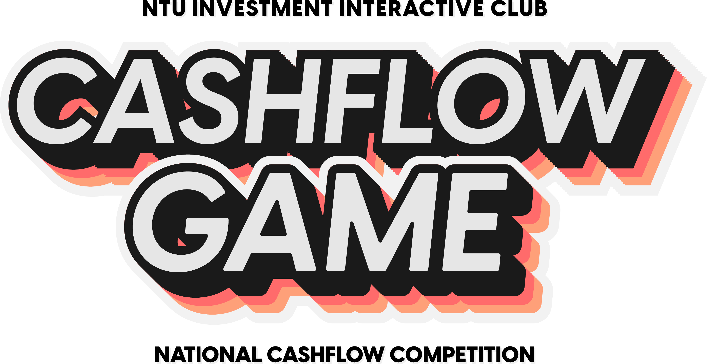

<div align="center">
  
  
  <br/>
  
  A comprehensive digital financial literacy board game designed to teach money management, investment strategies, and entrepreneurship within Singapore's economic landscape.

  
  
  
  
  
  
  <small>
    📖 <a href="docs/IIC%20Cashflow%20Game%202025%20-%20Manual.pdf">Game Manual</a> • 
    📰 <a href="https://blogs.ntu.edu.sg/sao-ntuiic/national-cashflow-competition-boardgame/">NTU IIC Blog Post</a> • 
    📚 <a href="docs/IIC%20Cashflow%20Game%202025%20-%20Yearbook.pdf">Yearbook Write-up</a>
  </small>
</div>

---

## 📋 Table of Contents

- [Introduction](#introduction)
  - [Project Overview](#project-overview)
  - [Mission & Motivation](#mission--motivation)
- [Technical Stack](#technical-stack)
  - [Architecture & Patterns](#architecture--patterns)
  - [State Management](#state-management)
  - [Project Structure](#project-structure)
- [Game Features](#game-features)
  - [💰 Account Management System](docs/game-features/account-management.md) - Three-tier financial account system
  - [📈 Stock Market Simulation](docs/game-features/stock-market.md) - Geometric Brownian Motion with ESG integration
  - [🏢 Career Progression System](docs/game-features/career-progression.md) - 8 career paths with skill-based advancement
  - [🏪 Business Management](docs/game-features/business-management.md) - 5 business sectors with R&D and competition
  - [🏠 Asset Management](docs/game-features/asset-management.md) - Real estate and vehicle investment systems
  - [📊 Budgeting System](docs/game-features/budgeting-system.md) - 5-category income allocation system
  - [🌱 ESG Integration](docs/game-features/esg-integration.md) - Environmental, Social, Governance scoring
  - [🔄 Economic Cycles](docs/game-features/economic-cycles.md) - 4-phase economic cycle simulation
  - [🌍 World Events](docs/game-features/world-events.md) - Random events affecting specific sectors
  - [👥 Personal Life Progression](docs/game-features/personal-life.md) - Life stage advancement system
  - [🎓 Education System](docs/game-features/education-system.md) - Formal and informal learning pathways
  - [💸 Loans and Debt](docs/game-features/loans-and-debt.md) - Asset and business financing options
  - [🏆 Scoring Formula](docs/game-features/scoring-formula.md) - Comprehensive scoring system
- [📖 Game Rules](docs/game-rules.md) - Turn structure and victory conditions
- [📱 Installation & Setup](docs/technical/installation-setup.md) - Development environment setup
- [Contributing](#contributing)
- [License](#license)

---

## 🎯 Introduction

### Project Overview

**IIC Cashflow Game 2025** (Project Alpha) is an innovative digital board game developed by Bryan Soong and team, licensed to NTU's Investment Interactive Club (IIC) as part of their AY24/25 digitalization efforts. This iOS-exclusive Flutter application transforms complex financial concepts into an engaging, interactive learning experience.

The game challenges players to navigate Singapore's financial landscape through strategic decision-making across multiple domains: career advancement, stock market investments, business management, asset acquisition, and personal life progression. Players compete to maximize their final score through a sophisticated scoring system that balances wealth accumulation, happiness, debt management, and ESG (Environmental, Social, Governance) contributions.


### Mission & Motivation

Our mission is to democratize financial education by making it accessible, practical, and engaging. In an era where financial transactions increasingly rely on digital platforms, enpowering players to:

- **Master Financial Decision-Making**: Experience real-world financial scenarios in a risk-free environment
- **Understand Investment Strategies**: Learn stock market dynamics, portfolio management, and ESG investing
- **Develop Entrepreneurial Skills**: Navigate business creation, competition, and strategic growth
- **Embrace Sustainable Finance**: Discover how ESG factors influence modern financial success
- **Build Financial Literacy**: Gain practical knowledge of budgeting, loans, and wealth management

---

## 🛠 Technical Stack

### Architecture & Patterns

- **Framework**: Flutter (targeting iOS exclusively)
- **Language**: Dart (SDK >=3.3.1 <4.0.0)
- **Architecture**: Modular service-oriented architecture with clear separation of concerns
- **Design Pattern**: Manager pattern for game systems, Observer pattern for state updates

### State Management

- **Primary**: Provider package for reactive state management
- **Local State**: ChangeNotifier for individual components
- **Global State**: GetIt service locator for singleton game managers
- **Data Flow**: Unidirectional data flow with clear manager responsibilities

### Project Structure

```
lib/
├── logic/                    # Core game logic and business rules
│   ├── accounts_logic.dart   # Financial account management
│   ├── financial_market_logic.dart # Stock market simulation
│   ├── business_logic.dart   # Business creation and management
│   ├── career_logic.dart     # Career progression system
│   ├── economy_logic.dart    # Economic cycle management
│   ├── game_logic.dart       # Main game orchestration
│   └── data/                 # Game data models
├── ui/                       # User interface components
│   ├── common/              # Reusable UI components
│   └── screens/             # Game screen implementations
├── services.dart            # Global service providers
└── main.dart               # Application entry point
```

**Key Dependencies**:
- `provider`: State management and reactive programming
- `get_it`: Dependency injection and service location
- `lottie`: Animation support for enhanced UX
- `vector_math`: Mathematical operations for game calculations
- `logging`: Comprehensive logging system

---

## 🎮 Game Features

The IIC Cashflow Game 2025 features a comprehensive set of interconnected systems that simulate real-world financial decision-making. Each system is designed to teach specific aspects of financial literacy while contributing to the overall gameplay experience.

### Core Game Systems

The game is built around several key systems that work together to create a realistic financial simulation:

- **Financial Management**: Three-tier account system with different interest rates and purposes
- **Market Dynamics**: Sophisticated stock market simulation with economic cycles and world events
- **Career Development**: Skill-based progression across multiple industries
- **Entrepreneurship**: Business creation and management with competition dynamics
- **Asset Building**: Real estate and vehicle investments with appreciation and depreciation
- **Life Balance**: Personal life progression affecting happiness and investment opportunities
- **Sustainable Finance**: ESG integration throughout all financial decisions

For detailed information about each system, please refer to the individual documentation files linked above.

---

### 📚 Documentation Structure

Each game feature has been documented in detail in separate files for better organization and maintainability:

#### Core Financial Systems
- [Account Management](docs/game-features/account-management.md): Savings, Investment, and CPF accounts with interest calculations
- [Stock Market](docs/game-features/stock-market.md): GBM-based price simulation with market sentiment factors
- [Budgeting System](docs/game-features/budgeting-system.md): 5-category income allocation affecting skills and happiness

#### Career & Development
- [Career Progression](docs/game-features/career-progression.md): 8 career paths from entry-level to executive positions
- [Education System](docs/game-features/education-system.md): Formal degrees and online learning options
- [Personal Life](docs/game-features/personal-life.md): Single to Family progression affecting happiness

#### Business & Assets
- [Business Management](docs/game-features/business-management.md): 5 sectors with R&D, competition, and valuation mechanics
- [Asset Management](docs/game-features/asset-management.md): Real estate and vehicle investments with loans
- [Loans and Debt](docs/game-features/loans-and-debt.md): Asset and business financing with debt management

#### Market Dynamics
- [Economic Cycles](docs/game-features/economic-cycles.md): 4-phase cycle affecting all investments
- [World Events](docs/game-features/world-events.md): Random sector-specific market disruptions
- [ESG Integration](docs/game-features/esg-integration.md): Sustainable finance scoring throughout gameplay

#### Game Mechanics
- [Scoring Formula](docs/game-features/scoring-formula.md): Comprehensive point calculation system

---

### Quick Reference

**Initial Setup**: Players start with $4,000 savings, $1,000 investments, skill level 1, 100 happiness
**Victory Condition**: Highest final score combining assets, happiness, debt management, life goals, and ESG
**Game Duration**: 12-15 rounds with economic and market updates each round
**Core Mechanics**: Turn-based movement, financial decisions, strategic resource allocation

---

## 🤝 Contributing

**Project Status: Discontinued**

This project has been **discontinued** and is **no longer actively maintained**. The IIC Cashflow Game 2025 was developed as an educational tool and has served its purpose within NTU's Investment Interactive Club.

### For Interested Parties

If you are interested in:
- Continuing development of this project
- Using this codebase for educational purposes
- Collaborating on similar financial literacy games
- Discussing the project's architecture or implementation

Please feel free to contact **Bryan Soong** at: **bryansoong35@gmail.com**

### Project Archive

This repository serves as an archive of the educational financial literacy game. While no active development is planned, the codebase remains available under the CC-BY-NC-4.0 license for educational and non-commercial use.

### Legacy Documentation

All documentation, game mechanics, and technical implementation details have been preserved in this README for educational reference and potential future development by interested parties.

---

## 📄 License

**IIC Cashflow Game 2025** is licensed under the [Creative Commons Attribution-NonCommercial 4.0 International License](LICENSE).

### License Summary

This software is provided for educational and non-commercial purposes only.

**Permitted Uses:**
- Educational instruction and learning
- Academic research and analysis
- Non-commercial sharing and modification with attribution

**Restrictions:**
- Commercial use, distribution, or monetization is strictly prohibited
- All derivative works must maintain the same license terms
- Attribution to the original author is required

### Copyright Notice

© 2025 Bryan Soong. All rights reserved.

Licensed to Nanyang Technological University Investment Interactive Club (NTU IIC) for educational purposes.

### Contact Information

For licensing inquiries or permissions beyond the scope of this license, please contact:

**Bryan Soong**  
Email: bryansoong35@gmail.com

---

## 🙏 Special Thanks

Sincere gratitude to the following individuals who contributed to the development of the IIC Cashflow Game 2025:

**Development Team:**
- Raphel Sim
- Eldon Lim

**Art & Design:**
- Chooi Jia Yue
- Neriah Tan

**Game Design:**
- Phoon Mei Gi
- Kevin Yok

Their dedication and expertise were instrumental in bringing this educational financial literacy game to life.

---

<div align="center">
  
**Developed with ❤️ by Bryan Soong**

*Licensed to NTU Investment Interactive Club*

*Empowering the next generation of financially literate individuals through innovative gamification*

Version 0.4.1 Build 4 (Discontinued)

</div>